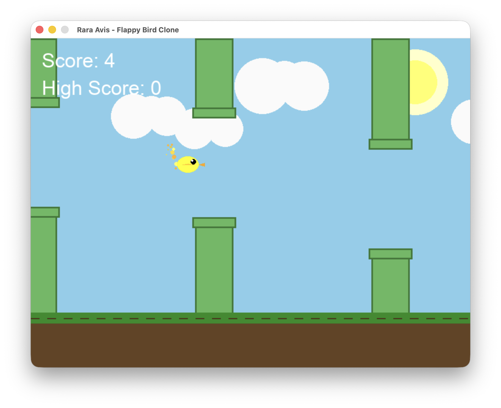
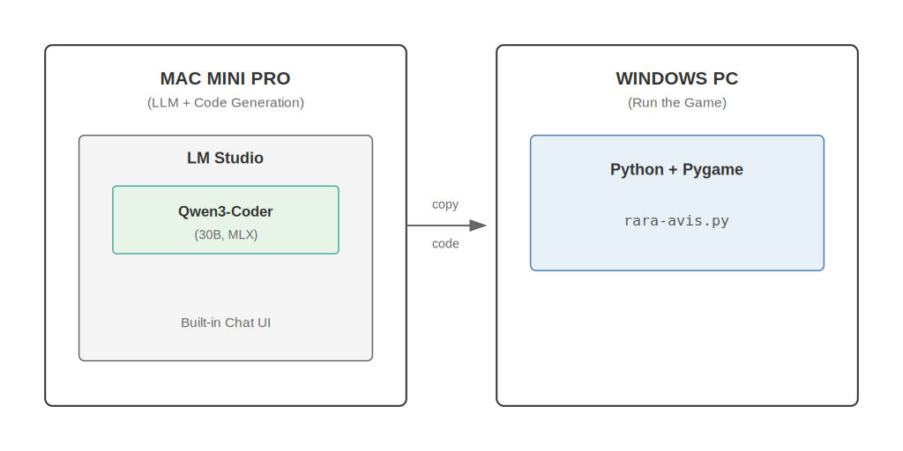
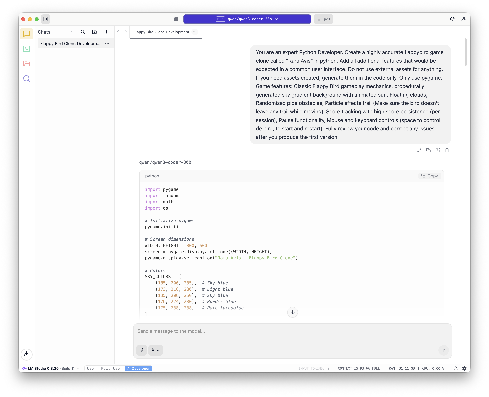

# Experiment 01: Rara Avis 🐦

A Flappy Bird clone written entirely in Python using Pygame — **100% AI-generated code**.


## About

This game was created as an **experiment in AI-assisted software development**. The entire codebase was generated by a **local LLM running on consumer hardware**, with no external assets — all graphics are procedurally generated in code.

<p align="center" width="100%">
    
</p>

### Features

- 🎮 Classic Flappy Bird gameplay mechanics
- 🌅 Procedurally generated sky gradient background with animated sun
- ☁️ Floating clouds
- 🟢 Randomized pipe obstacles
- ✨ Particle effects trail
- 📊 Score tracking with high score persistence (per session)
- ⏸️ Pause functionality
- 🖱️ Mouse and keyboard controls

---

## Architecture

This experiment uses a **two-machine setup**:

<p align="center" width="100%">
    
</p>

| Machine | Role | What runs there |
| ------- | ---- | --------------- |
| **Mac Mini Pro** | LLM Server | LM Studio with Qwen3-Coder model |
| **Windows PC** | Development | Python environment to run the generated game |

> **Note**: You can run everything on a single machine if it has enough RAM (32GB+ recommended for the 30B model).

---

## AI Generation Details

### Hardware

- **Mac Mini Pro** with **64GB** of unified memory

### Software

- [LM Studio](https://lmstudio.ai/) v0.3.36
- Model: [Qwen3-Coder-30B-A3B-Instruct-MLX-8bit](https://huggingface.co/lmstudio-community/Qwen3-Coder-30B-A3B-Instruct-MLX-8bit) (MLX optimized for Apple Silicon)

### Performance

The local LLM achieved excellent performance during code generation:

| Metric | Value |
| ------ | ----- |
| Generation Speed | **51.28 tok/sec** |
| Total Tokens | 3,580 |
| Time to First Token | 0.71s |

### Prompt

This was the initial prompt ([source](https://digitalspaceport.com/about/testing-local-llms/)) that I used. The game worked with some issues on the graphics, like leaving trails, but with few additional prompts I was able to get it finished.

> You are an expert Python Developer. Create a highly accurate flappybird game clone called "Rara Avis" in python. Add all additional features that would be expected in a common user interface. Do not use external assets for anything. If you need assets created, generate them in the code only. Only use pygame. Game features: Classic Flappy Bird gameplay mechanics, procedurally generated sky gradient background with animated sun, Floating clouds, Randomized pipe obstacles, Particle effects trail (Make sure the bird doesn't leave any trail while moving), Score tracking with high score persistence (per session), Pause functionality, Mouse and keyboard controls (space to control de bird, to start and restart). Fully review your code and correct any issues after you produce the first version.

<p align="center" width="100%">
    
</p>

---

## Installation & Running

### Prerequisites

#### On the Mac (LLM Server)

1. **Download and install LM Studio**:

   - Go to [lmstudio.ai](https://lmstudio.ai/)
   - Download the macOS version
   - Drag LM Studio to your Applications folder
   - Launch LM Studio

2. **Download the Qwen3-Coder model**:

   - In LM Studio, go to the **Discover** tab (magnifying glass icon)
   - Search for `Qwen3-Coder-30B-A3B-Instruct-MLX`
   - Click **Download** on the 8-bit MLX version
   - Wait for the download to complete (~16GB)

3. **Load the model**:

   - Go to the **Chat** tab
   - Click the model dropdown at the top
   - Select `Qwen3-Coder-30B-A3B-Instruct-MLX-8bit`
   - Wait for the model to load into memory (watch the RAM usage)

> **💡 No IDE needed!** LM Studio has a built-in Chat interface. You interact with the LLM directly in the Chat tab — just type your prompt and copy the generated code.

#### On the Windows PC (Development Workstation)

**Install Python** (3.11+ recommended):

```bash
# Option 1: Download from python.org
# Go to https://www.python.org/downloads/windows/
# Download Python 3.13 or later
# Run the installer (check "Add Python to PATH")

# Option 2: Using winget
winget install Python.Python.3.13
```

**Verify Python installation**:

```powershell
python --version
# Should show Python 3.13.x or similar
```

---

### Setup (Windows PC)

1. **Clone the repository**:

   ```bash
   git clone https://github.com/LuisPalacios/rara-avis
   cd rara-avis/experiments/01-rara-avis-game
   ```

2. **Create a virtual environment**:

   ```powershell
   # PowerShell
   python -m venv .venv
   .\.venv\Scripts\Activate.ps1
   ```

   ```bash
   # Git Bash
   python -m venv .venv
   source .venv/Scripts/activate
   ```

3. **Install dependencies**:

   ```bash
   pip install -r requirements.txt
   ```

---

### Run the Game (Windows PC)

```bash
python rara-avis.py
```

### Controls

| Action | Input |
| ------ | ----- |
| Flap / Start | `SPACE` or `Mouse Click` |
| Pause | `P` |

---

## Reproducing This Experiment

If you want to generate the game yourself:

1. **On your Mac**: Open LM Studio Chat with Qwen3-Coder loaded
2. **Copy the prompt** from the [Prompt section](#prompt) above
3. **Paste it into LM Studio** and press Enter
4. **Wait for generation** (~3,500 tokens, about 70 seconds at 50 tok/sec)
5. **Copy the generated code** to a file called `rara-avis.py`
6. **On your Windows PC**: Create the virtual environment and run the game
7. **Iterate**: If there are bugs, describe them to the LLM and ask for fixes

---

## Lessons Learned

1. **Local LLMs are capable**: A quantized 30B model can generate functional game code in seconds
2. **Iterative prompting works**: Initial output had bugs, but follow-up prompts fixed them quickly
3. **No external assets needed**: Procedural graphics are good enough for prototypes
4. **LM Studio Chat is sufficient**: No need for complex IDE integrations for simple projects
